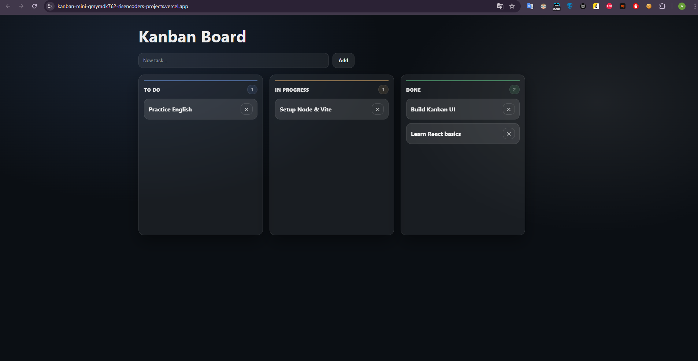

# Kanban Board App

A modern Kanban board with drag & drop built using React, TypeScript and dnd-kit.

[](https://kanban-mini-lemon.vercel.app)

## 🚀 Live Demo

👉 https://kanban-mini-lemon.vercel.app

## 📷 Preview

[](https://kanban-mini-lemon.vercel.app)

## ✨ Features

- Drag & Drop tasks between columns
- Add and delete tasks
- LocalStorage persistence
- Responsive layout
- Modern glassmorphism UI
- Smooth animations

## 🛠 Tech Stack

- React
- TypeScript
- Vite
- dnd-kit
- CSS

## 📦 Installation

Clone the repository:
```bash
git clone https://github.com/Risencoder/kanban-mini.git
```
Install dependencies:```
npm install```

Run development server:```
npm run dev```


## 🎯 Project Purpose

This project was created as a portfolio example to demonstrate:
Frontend architecture with React + TypeScript
Drag & Drop interactions
State management
UI/UX implementation
Deployment with Vercel

## 👨‍💻 Author

Anton Kuzenko
GitHub: https://github.com/Risencoder